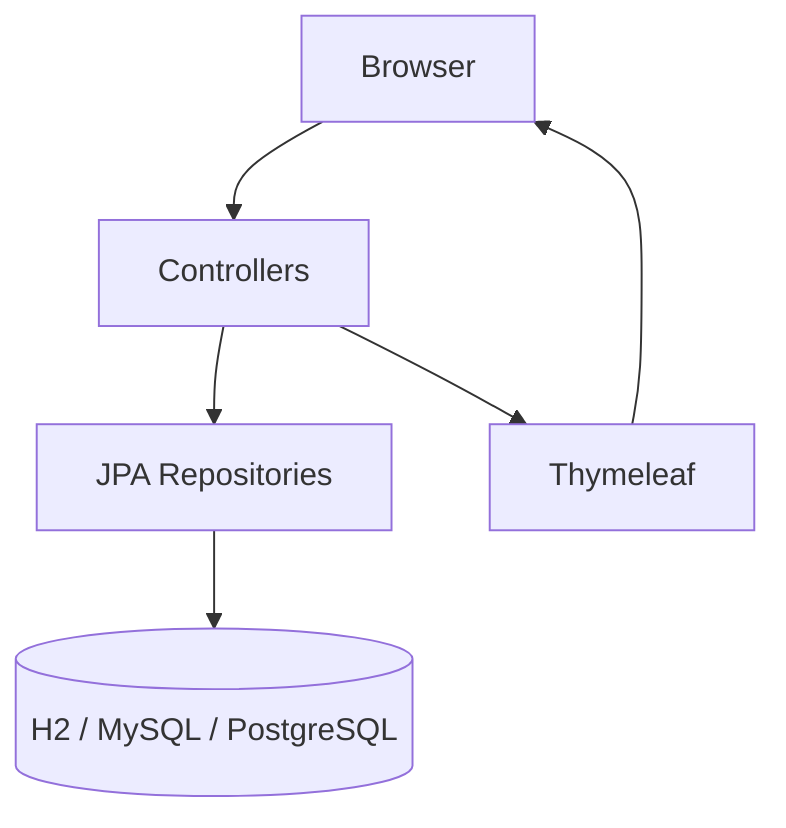
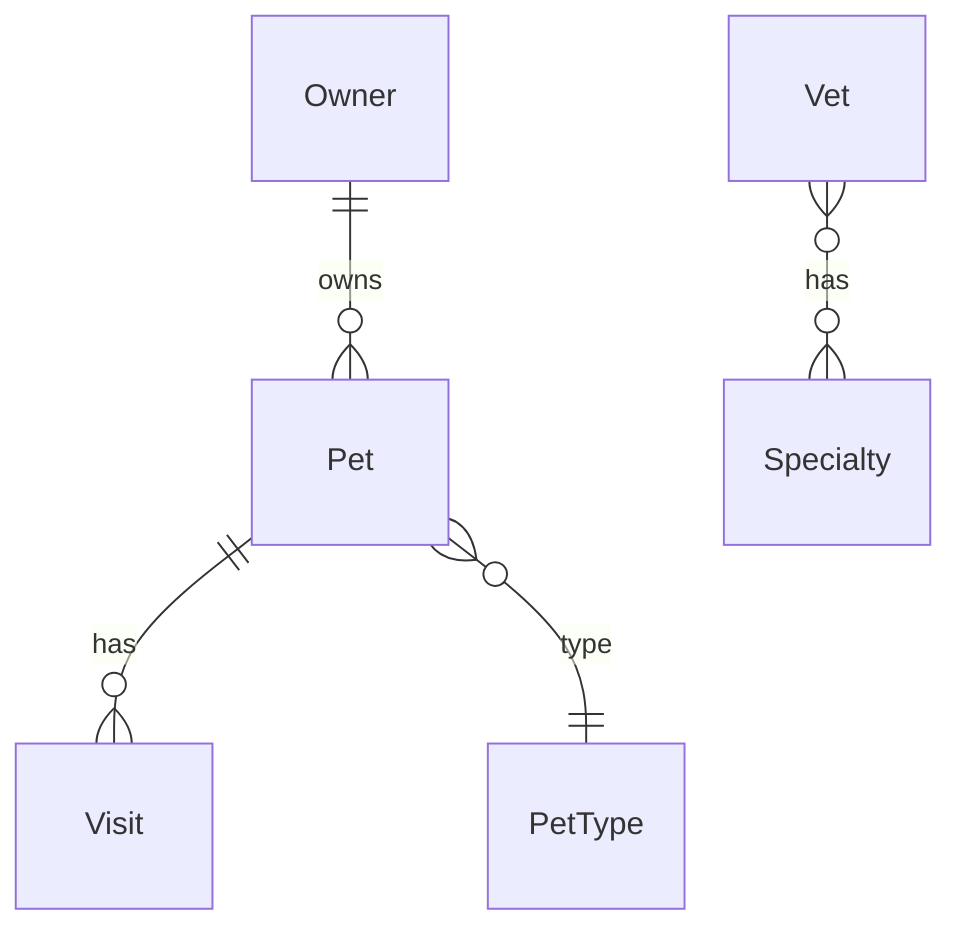

# Spring PetClinic — Architecture

Canonical Spring Boot sample: a **monolithic, server-rendered** veterinary clinic app. One deployable JAR; no microservices and no separate service layer in production code.

## Stack

| Component | Technology |
|-----------|------------|
| Runtime | Java 17+, Spring Boot 4.0.3 |
| Web | Spring Web MVC, Thymeleaf |
| Persistence | Spring Data JPA, Hibernate |
| Validation | Jakarta Bean Validation |
| Cache | Spring Cache (JCache) |
| Ops | Spring Actuator |
| Build | Maven or Gradle |

## High-level flow



Typical request: **Browser → Controller → Repository → DB → Model → Thymeleaf → HTML**.

## Layers

| Layer | Location | Role |
|-------|----------|------|
| Presentation | `*Controller.java`, `templates/` | HTTP, forms, validation, views |
| Domain | `model/`, `owner/`, `vet/` | JPA entities |
| Persistence | `*Repository.java` | Spring Data JPA |
| Infrastructure | `system/` | Cache, i18n, welcome/error |
| Database | `resources/db/{h2,mysql,postgres}/` | `schema.sql`, `data.sql` |

## Package layout

```
org.springframework.samples.petclinic
├── PetClinicApplication.java
├── model/          BaseEntity, NamedEntity, Person
├── owner/          Owner, Pet, Visit, PetType + controllers/repos
├── vet/            Vet, Specialty + VetController, VetRepository
└── system/         WelcomeController, CacheConfiguration, WebConfiguration
```

Organized **by feature** (`owner`, `vet`), not by technical layer.

## Domain model



- `BaseEntity` → `NamedEntity` → `PetType`, `Specialty`
- `BaseEntity` → `Person` → `Owner`, `Vet`

## Main routes

| Path | Purpose |
|------|---------|
| `/` | Welcome |
| `/owners/**` | Find, create, update owners |
| `/owners/{id}/pets/**` | Pets |
| `/owners/{id}/pets/{petId}/visits/**` | Visits |
| `/vets.html` | Vets (HTML) |
| `/vets` | Vets (JSON/XML) |

## UI

- Server-side Thymeleaf under `src/main/resources/templates/`
- Shared layout: `fragments/layout.html`
- Static assets + Bootstrap (WebJars); SCSS → CSS via Maven `css` profile
- i18n: `messages/*.properties`, `?lang=` via `WebConfiguration`

## Data & persistence

- JPA with `ddl-auto=none`; schema from SQL scripts
- Repositories extend `JpaRepository` with query methods
- **Profiles:** default **H2** in-memory; `mysql` / `postgres` for persistent DBs
- Vet list cached in JCache region `vets` (`CacheConfiguration`)

## Deployment

| Concern | Notes |
|---------|--------|
| Run locally | `./mvnw spring-boot:run` → http://localhost:8080 |
| Container | `./mvnw spring-boot:build-image` (no Dockerfile in repo) |
| Local DB | `docker-compose.yml` (MySQL, PostgreSQL) |
| Kubernetes | `k8s/petclinic.yml`, `k8s/db.yml` |

## Tests

`src/test/java/` — controller/unit tests (MockMvc), integration tests (H2), MySQL (Testcontainers), PostgreSQL (Docker Compose).

## Design traits

1. **Monolith** — single application, thin vertical slices
2. **Controllers → repositories** — no `@Service` layer (demo simplicity)
3. **Convention over configuration** — Spring Boot auto-config, Spring Data naming
4. **Multi-DB** — same app, profile-driven database switch
